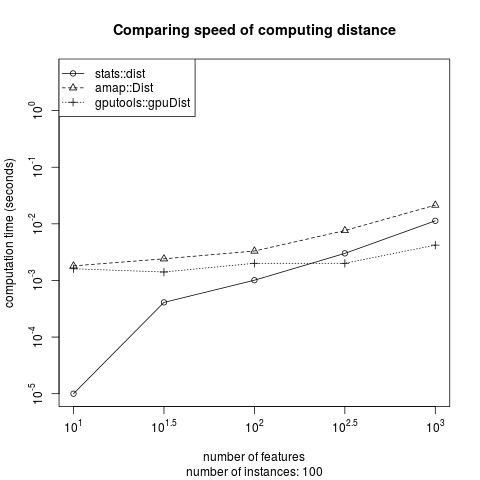

```{r setup, include = FALSE}
library(animation)
library(knitr)
show.obj <- function(obj) {
  paste(trimws(deparse(obj)), collapse = " ")
}
.quote <- "`"
quoted.string <- function(str) {
  sprintf("%s%s%s", .quote, str, .quote)
}
opts_chunk$set(fig.width = 5, fig.height = 5)
```

# Overview

This package implements the self-updating process clustering algorithms proposed by @Shiu2016supc. This document shows how to reproduce the examples and figures in the paper.

According to the paper, The Self-Updating Process (SUP) is a clustering algorithm that stands from the viewpoint of data
points and simulates the process how data points move and perform self-clustering. It is an iterative
process on the sample space and allows for both time-varying and time-invariant operators.

The paper shows that SUP is particularly competitive for:

- Data with noise
- Data with a large number of clusters
- Unbalanced data

# Installation

To build the package from source, the Windows user requires [Rtools](http://cran.csie.ntu.edu.tw/bin/windows/Rtools/) and the Mac OS X user requires [gfortran](http://cran.csie.ntu.edu.tw/bin/macosx/tools/).

To get the current development version from github:

```r
# install.packages('remotes')
remotes::install_github("wush978/supc")
```

# Algorithm

## Notation

- $x_1^{(0)}, ..., x_N^{(0)} \in \mathbb{R}^{p}$ are the data to be clustered.
- $f_t$ is a function which measures the influence between two data point at the $t$-th iteration.
- $\left\lVert \cdot \right\lVert_p$ is the $L_p$ norm.

## Truncated exponential decay function

This package uses $f_t$ as the truncated exponential decay function. Other functions such as the q-Gaussian and the inverse of the distance function can also be considered.

At the $t$-th iteration, the truncated exponential decay function $f_t$ is:

$$\begin{equation} f_t(x_i^{(t)}, x_j^{(t)}) = \left\{ \begin{array}{lc}
exp\left(\cfrac{-\left\lVert x_i^{(t)} - x_j^{(t)} \right\lVert_2}{T(t)}\right) & \text{if } \left\lVert x_i^{(t)} - x_j^{(t)} \right\lVert_2 \leq r \\ 
0 & \text{if } \left\lVert x_i^{(t)} - x_j^{(t)} \right\lVert_2 > r
\end{array} \right. \label{eq:influence} \end{equation}$$

## Self-Updating Process

The SUP updates the data points via:

$$\begin{equation} x_i^{(t+1)} = \sum_{j=1}^N{\frac{f_t(x_i^{(t)}, x_j^{(t)})}{\sum_{k=1}^N{f_t(x_i^{(t)}, x_k^{(t)})}} x_j^{(t)}} \label{eq:sup} \end{equation}$$

The iteration stops after convergence. We compare the $\sum_{i=1}^N {\left\lVert x_i^{(t)} - x_i^{(t + 1)} \right\rVert_1}$ with `tolerance`. If the sum of the $L_1$ distance is lower than `tolerance`, then the computation stops and returns $x_1^{(t)}, ..., x_N^{(t)}$.

## Clustering

After retrieving $x_1^{(t)}, ..., x_N^{(t)}$ from SUP, we compute the connected components of the graph:

$$(V, E) = \left(\{1, 2, ..., N\}, \left\{ (i,j) | \left\lVert x_i^{(t)} - x_j^{(t)} \right\rVert_2 < tolerance \right\}\right).$$

Each connected component is a cluster.

# Usage

The function `supc1` in this package implements the SUP clustering. 

## Data

The argument `x` should be a matrix in which the rows represent the instances and the columns represent the features.

## Parameters

As shown in $\eqref{eq:influence}$, SUP requires the following two parameters:

- $r$ determines the truncation of the influential function $f_t$.
- $T(t)$ controls the speed of the convergence.

### Control the parameter $r$

`supc1` provides two options for users to control the parameter $r$.

The user can directly supply the value of $r$ if `r` is given as a vector, then `supc1` will compute
clustering results using each of the values provided in the numeric vector `r`. In such a case, `supc1`
will return a `supclist` which contains `supc` objects for each value in `r`.

In stead of the value of $r$, the user can choose to supply the quantile of the pairwise distance between
instances. In this case, the user should provide `rp`, which is a value between 0 and 1. `supc1` will compute
the pairwise distances between all instances in the data to obtain the $r$ value according to the given `rp`
value. If `rp` is a vector, `supc1` will return a `supclist`, which contains `supc` objects for each value in 
`rp`.

If neither `r` nor `rp` is provided, then `supc1` will use `r quoted.string(sprintf("rp = %s", show.obj(supc:::.rp.default)))` as the default.

### Control the parameter $T(t)$

`supc1` has parameter `t` to control $T(t)$, which can be either static or dynamic temperature.

By default, the package uses $T(t) = \frac{r}{5}$ and $T(t) = \frac{r}{20} + t \times \frac{r}{50}$ for `static` and `dynamic` 
temperature, respectively, which are the temperatures used in the paper. In details, if a character value specified as `t = "static"`,
`supc1` will set `t` as `function(r) {function(t) {r/5}}`, where `r` is the input value for parameter `r`. In this case,
the temperature is kept as a constant of $\frac{r}{5}$ at each iteration. If a character value specified as `t = "dynamic"`, `supc1`
will set `t` as `function(r)｛function(t) {r/20 + t * (r/50)}}`. In this case, the initial temperature is $\frac{r}{20}`, and the
temperature gradually increases by \frac{r}{50} after each iteration.

The package also allows user-specified temperature functions. If `t` is set as a numeric value, then `supc1` uses this value as the 
static temperature throughout iterations. If `t` is set as a function, then `supc1` will uses the value `t(i)` as the temperature at 
each of the $i$-th iteration.

The user can use different temperatures $T(t)$ with different $r$ values by setting `t` as a list of function. Then `supc1` will calculate
the clustering result for each pair of $T(t)$ and $r$.

## Utility

This package let the user to choose the implementation of computing distance. Currently, `stats::dist`, `amap::Dist` and `gputools::gpuDist` are included. The user could choose the best fitted one according to the data. There is a c++ implementation of the main algorithm which costs about 50% times compared to the implementation in R. The vignettes also show how to plot figures for analysis purpose.

### Computation of the distance

The user can use `dist.mode` to select the package to compute the pairwise distance between instances. Specifying `dist.mode("stats")`, `dist.mode("amap")`, and `dist.mode("gputools")` will select `stats::dist`, `amap::Dist`, and `gputools::gpuDist` to compute the pairwise distance matrix, respectively. It is recommended to compare the computation time of `stats::dist(x)`, `amap::Dist(x)` and `gputools::gpuDist(x)` before selecting the function.

For example, on my machine whose CPU is `Intel(R) Core(TM) i7-4820K CPU @ 3.70GHz` and GPU is `NVIDIA Corporation GK107GL [Quadro K2000]`, the computation time of different function is:



The results show that `stats::dist` is the best choice if the distance matrix is small. `gputools::gpuDist` outperforms the others if the distance matrix is larger. If there is no GPU, `amap::Dist` might be a better choice for larger distance matrices.

```{r computation-time, eval = FALSE, echo = FALSE}
get.x <- function(m, n) {
  matrix(rnorm(m * n), m, n)
}
dist.time <- lapply(list(stats::dist, function(x) amap::Dist(x, nbproc = 8), gputools::gpuDist), function(.dist) {
  outer(floor(10^seq(2, 3, by = 0.5)), floor(10^seq(1, 3, by = 0.5)), Vectorize(function(a, b) {
    set.seed(1)
    X <- get.x(a, b)
    cat(sprintf("%d,%d\n", a, b))
    mean(sapply(1:10, function(i) system.time(.dist(X))[3]))
  }))
})
```

```{r computation-time-result, echo = FALSE, warning = FALSE, error = FALSE, results='none'}
if (!file.exists("dist.gif")) {
  dist.time <- list(structure(c(0, 0.000999999999839929, 0.00959999999986394, 
  0.000399999999899592, 0.00270000000000437, 0.0268000000000939, 
  0.00100000000002183, 0.00889999999999418, 0.106199999999899, 
  0.00300000000006548, 0.0375999999999294, 0.795100000000002, 0.0112999999999374, 
  0.191300000000047, 4.82540000000017), .Dim = c(3L, 5L)), structure(c(0.00180000000000291, 
  0.00480000000015934, 0.022899999999936, 0.0024000000000342, 0.00780000000004293, 
  0.0545000000000073, 0.00329999999985375, 0.02270000000035, 0.152599999999711, 
  0.00759999999991123, 0.0563999999998487, 0.547500000000036, 0.0213999999999942, 
  0.202700000000277, 2.1983000000002), .Dim = c(3L, 5L)), structure(c(0.00160000000005311, 
  0.00650000000014188, 0.0901999999999134, 0.00140000000019427, 
  0.00670000000009168, 0.0805000000000291, 0.00200000000004366, 
  0.00779999999986103, 0.0997000000001208, 0.00200000000004366, 
  0.0124000000001615, 0.140099999999984, 0.00420000000003711, 0.0291999999998552, 
  0.332999999999993), .Dim = c(3L, 5L)))
  
  
  local({
    dist.time <- lapply(dist.time, `+`, 1e-5)
    .x <- seq(1, 3, by = 0.5)
    .ymap <- function(y) log(y, 10)
    .y.max <- max(.ymap(unlist(dist.time)))
    .y.min <- min(.ymap(unlist(dist.time)))
    .y <- seq(floor(.y.min / 0.5) * 0.5, ceiling(.y.max / 0.5) * 0.5, by = 0.5)
    animation::saveGIF(lapply(1:3, function(j) {
      plot(.x, rep(1, length(.x)), type = 'n', ylim = c(.y.min, .y.max), xlab = "number of features", ylab = "computation time (seconds)", xaxt = 'n', yaxt = 'n')
      axis(1, .x, labels = expression(10^1, 10^1.5, 10^2, 10^2.5, 10^3))
      axis(2, .y[seq_along(.y) %% 2 == 1], labels = do.call(what = expression, lapply(.y, function(.) substitute(10^y, list(y = .))))[seq_along(.y) %% 2 == 1])
      lapply(1:3, function(i) {
        lines(.x, .ymap(dist.time[[i]][j,]), lty = i)
        points(.x, .ymap(dist.time[[i]][j,]), pch = i)
      })
      legend("topleft", c("stats::dist", "amap::Dist", "gputools::gpuDist"), lty = 1:3, pch = 1:3)
      title(main = "Comparing speed of computing distance")
      title(sub = sprintf("number of instances: %d", floor(10^seq(2, 3, by = 0.5)[j])))
    }), movie.name = "dist.gif", interval = 3)
  })
}
```

### Using implentation in `R` or in `C++`

This package provide both implementation for better maintenance. The `C++` program runs faster when the number of instances is larger. 
Without specifying, the `supc1` will use the implementation in `C++` as default. If `implementation = "R"` is specified, then `supc1`
will use the implementation in `R`.

### Verbose

Using `supc1` with `verbose = TRUE`, the program will show the $L_1$ distance between each iteration on the screen in real-time, so that 
the user can monitor the iterations to check if the program is still running or dead.

## Example

Here we reproduce the section 2.3 of @Shiu2016supc as an usage example.

### Data

We generate the sample data first:

```{r}
set.seed(1)
mu <- list(
  x = c(0, 2, 1, 6, 8, 7, 3, 5, 4),
  y = c(0, 0, 1, 0, 0, 1, 3, 3, 4)
)
X <- lapply(1:3, function(i) {
  cbind(rnorm(9, mu$x, 1/5), rnorm(9, mu$y, 1/5))
})
X <- do.call(rbind, X)
```

There are 9 different mean and each mean generates 3 sample data.

### Clustering

Then we could compute the SUP via `supc::supc1` with `r quoted.string("r = 0.9")` and `t = 0.75`:

```{r}
library(supc)
X.supc <- supc1(X, r = 0.9, t = 0.75)
str(X.supc)
```

The returned object has class "supc" which contains:

- `x`, the input data.
- `d0`, the distance matrix of the data.
- `r`, the value of $r$.
- `t`, the function of $T(t)$.
- `cluster`, the cluster label of each instances.
- `centers`, the center of the clusters.
- `size`, the size of the clusters.

#### Cluster

We could retrieve the cluster id of the instances via:

```{r}
X.supc$cluster
```

This is the cluster id of the corresponding instances. For example, the cluster id of the first instance, i.e. `X[1,]`, is `X.supc$cluster[1]`. There are `r length(unique(X.supc$cluster))` clusters.

#### Centers

The centers of the SUP algorithm, which is the final data point after iterations, is stored in `X.supc$centers`:

```{r}
X.supc$centers
```

Each row represents the center of the corresponding cluster id. For example, the center of cluster id 1 is `X.supc$centers[1,]`.

#### Size

The size of each cluster is stored in `X.supc$size`:

```{r}
X.supc$size
```

Note that the id is ordered by the size.

### The frequency polygon of the pairwise distance

To find the better choice of $r$, the section 2.4.1 in @Shiu2016supc suggests to use the sharp valleys of the frequency polygun. The user could directly compute the frequency polygun via:

```{r}
freq.poly(X)
```

There is a sharp valley around 3.5. Therefore, we compute the SUP clustering with following `r quoted.string("r = 0.9")`, `r quoted.string("r = 3.5")`, and `r quoted.string("r = 8")` as a comparison.

### `supclist`

To compute multiple parameters, the user can directly pass a vector to the corresponding parameters `r`, `rp`, or `t`:

```{r}
X.supcs <- supc1(X, r = c(0.9, 3.5, 8), t = 0.75)
```

The `supc1` will compute the results of all given `r`. Now, the `X.supcs` is a `supclist` object. We can retrieve all cluster id via:

```{r}
X.supcs$cluster
```

`r quoted.string("r = 0.9")` produces 9 clusters, `r quoted.string("r = 3.5")` produces 3 clusters and `r quoted.string("r = 8")` produces single clusters.

Also, the user can draw the frequency polygon and mark the given `r`:

```{r}
freq.poly(X.supcs)
```

### Heatmap

We could draw a heatmap of the centers as follow:

```{r heatmap}
plot(X.supc, type = "heatmap")
```

# Reference

